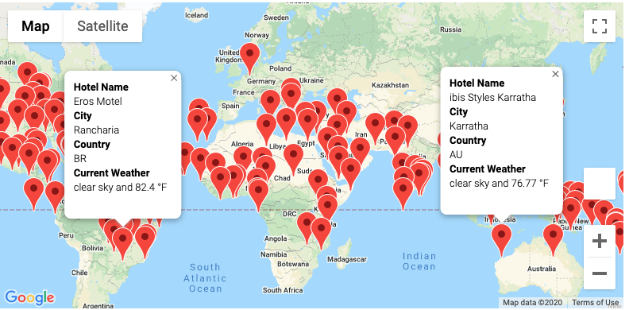
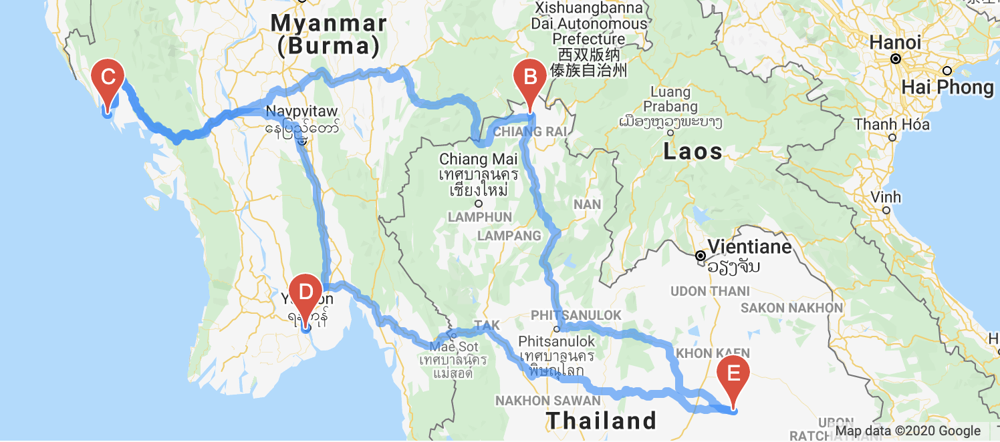

# World_Weather_Analysis

## Summary

The purpose of this analysis was to collect weather data and allow someone to choose their ideal temperature for a vacation. Eventually I used the google api to add a map with markers to make it easy to locate the hotels in the desired cities. After 4 locations were chosen based on the temperatures wanted, I created an intinerary map with those destinations.

Map with markers 
:-------------------------:
| 

Itinerary
:-------------------------:
| 
